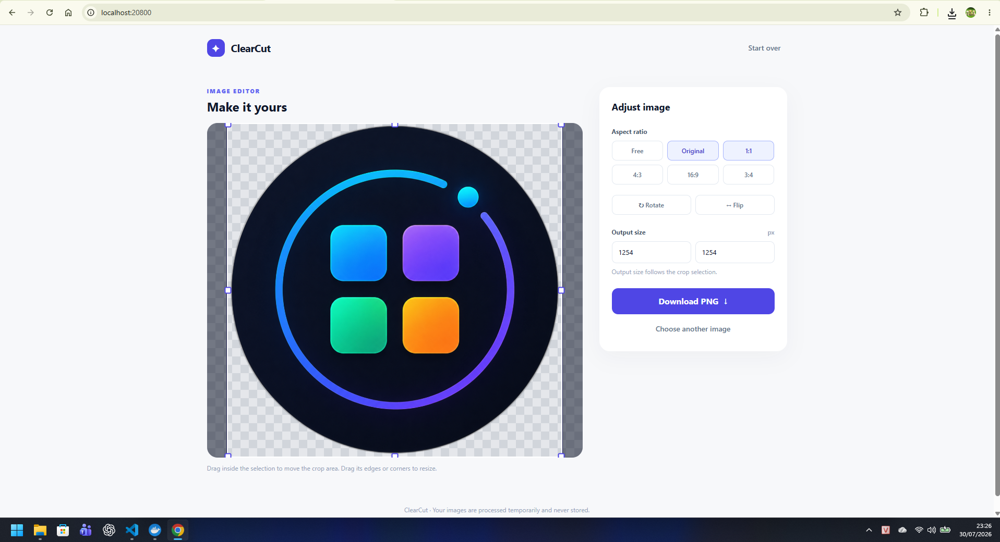

# ClearCut

> A fast, self-hosted workspace for creating clean transparent PNGs.

ClearCut removes image backgrounds locally, then gives you focused crop, resize, rotate, and flip controls before download. It is designed for product imagery, social graphics, profile photos, and any workflow that needs a clean cutout without sending images to a third-party API.



## Why ClearCut

- **Private by design** — images are processed by your own Docker services and are not stored persistently.
- **AI-powered removal** — uses a self-hosted `rembg` and ONNX processor; no API key or usage credits required.
- **Precision editing** — crop with resizable edge and corner handles, preserve an aspect ratio, rotate or flip, and export at the exact selected size.
- **Built for local teams** — one Docker Compose command starts the web app, Express API, and AI processor.

## Quick start

### Docker (recommended)

```bash
docker compose up --build
```

Open [http://localhost:20800](http://localhost:20800).

The processor downloads the `u2net` model on its first start and keeps it in the persistent Docker volume cache. The first boot can therefore take a little longer than later starts.

### Local development

```bash
npm install
npm run dev
```

The React app runs at `http://localhost:5173` and the Express API runs at `http://localhost:3001`. Start the processor through Docker when developing locally:

```bash
docker compose up processor
```

## How it works

1. Upload a JPG, PNG, or WebP image (up to 15 MB).
2. ClearCut sends it to the local AI processor and returns a transparent PNG.
3. Adjust the crop area, aspect ratio, rotation, flip, or output dimensions.
4. Download the final transparent PNG.

## Architecture

| Service | Responsibility |
| --- | --- |
| `apps/web` | React, Vite, TailwindCSS image-editing experience |
| `apps/api` | Express upload validation and processor orchestration |
| `apps/processor` | Python, `rembg`, and ONNX background-removal runtime |
| `packages/shared` | Shared limits and API contracts |

The repository uses npm workspaces and Docker Compose. The public API validates image format and dimensions, while the processor stays on the internal Docker network.

## Available commands

```bash
npm run dev          # Start web and API in development mode
npm run build        # Build every workspace
npm run typecheck    # Validate TypeScript
npm run test         # Run workspace tests
npm run docker:up    # Start the complete Docker stack
npm run docker:down  # Stop the Docker stack
```

## Tech stack

React · Express · TailwindCSS · Axios · Docker Compose · npm workspaces · `rembg` · ONNX Runtime

## License

ClearCut is released under the [MIT License](LICENSE).
